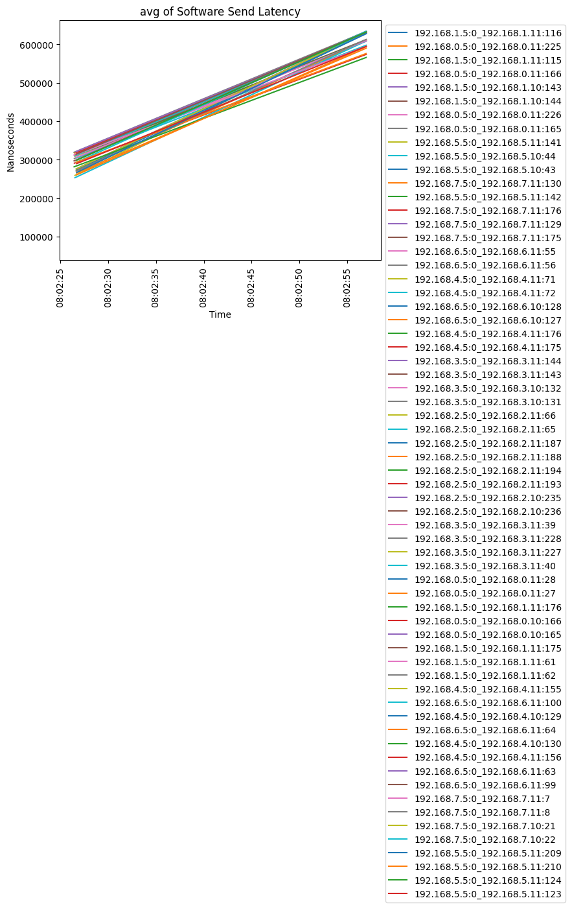
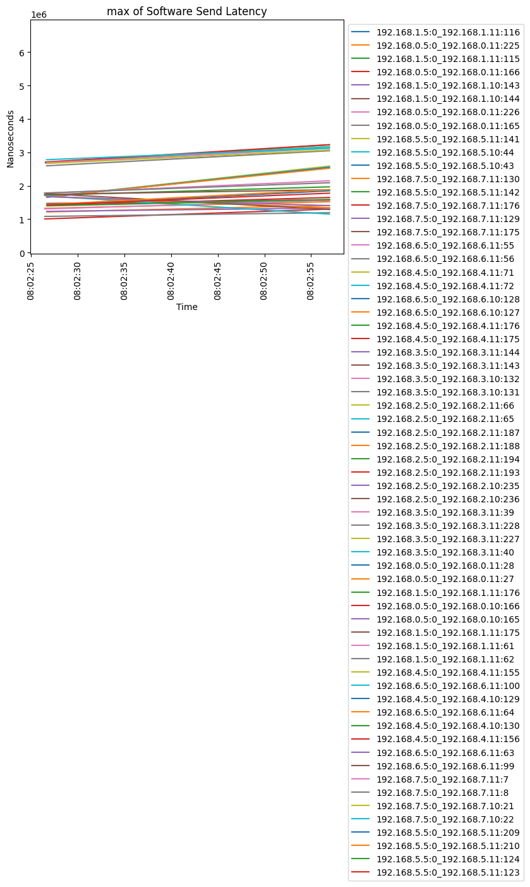
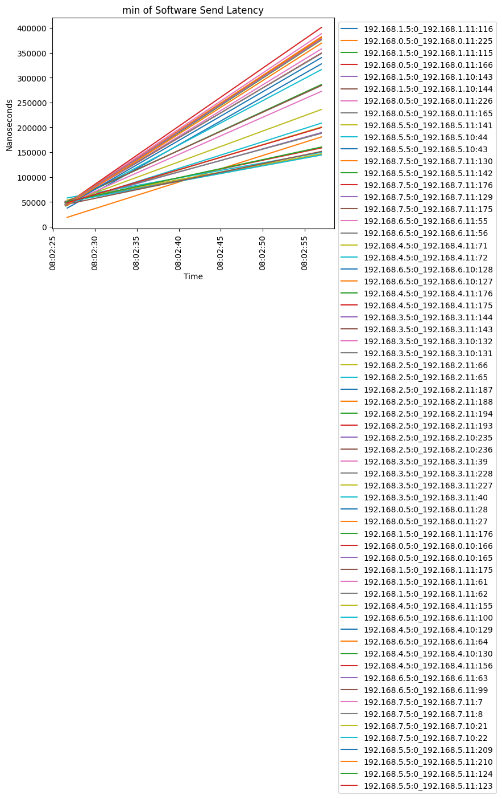
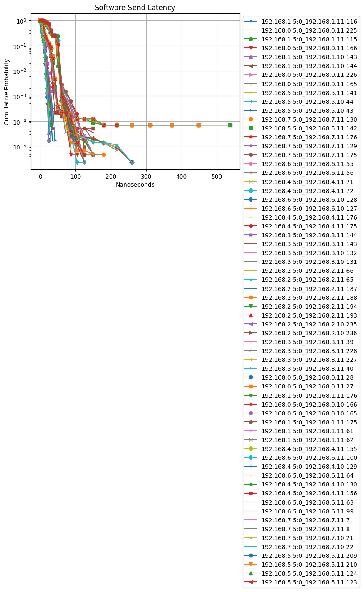
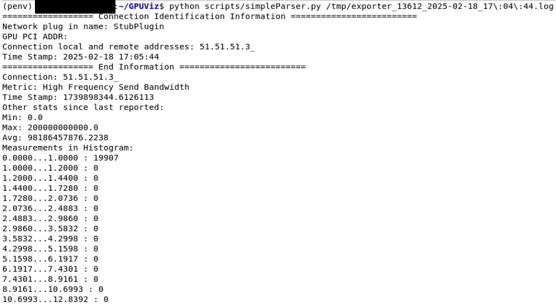

[//]: # (Copyright 2026 Google LLC)
[//]: # (Use of this source code is governed by a BSD-style)
[//]: # (license that can be found in the LICENSE file.)

### GPUViz

#### How to build libGPUViz.so locally.

1. Checkout code from the project repo https://github.com/gcp-ml-networking/GPUViz:

```
git clone https://github.com/gcp-ml-networking/GPUViz
cd GPUViz
git checkout main
```

2. Run build_gpuviz.sh, assuming your current directory is the main GPUViz directory checked out above:

```
cd scripts
sh build_gpuviz.sh
```
*Note:* You need to have Docker installed. You should always run build_gpuviz.sh from scripts directory as it has the Dockerfile needed for build.

3. All artifacts are placed in the directory path:

```
GPUViz/build/
```

#### How to work with bazel on container for development purpose.

We use bootstrap to build bazel for the release version of GPUViz. For development builds, an easy approach is to download bazelisk and then just copy the bazelisk to the PATH of your workstation/container:

```
wget https://github.com/bazelbuild/bazelisk/releases/download/v1.24.1/bazelisk-linux-amd64
chmod 755 bazelisk-linux-amd64 && cp bazelisk-linux-amd64 /usr/local/bin/bazel
```

The above example shows downloading bazelisk 1.24.1 for linux, giving it execute permissions, and finally copying it to your PATH. The full instructions are [here](https://github.com/bazelbuild/bazelisk/blob/master/README.md) and all the released binaries are [here](https://github.com/bazelbuild/bazelisk/releases).

After doing this, you can just use run your bazel build command, and then bazelisk will download the latest release version for you to build.


#### How to run telemetry benchmark test on container.

After running build_gpuviz.sh, a docker container named GPUViz should be created and running.

1. On the host, run this to enter the GPUViz container:

```
docker exec -it GPUViz /bin/sh
```

2. Now you can run the telemetry benchmarks inside the container.  This will run NCCL Tests, which runs a series of NCCL operations one at a time.  We use this to provide a benchmark of how much overhead GPUViz might add to each operation in the worst case:

```
# You should be running this in a shell inside the container
cd tests
gcc -O2 nccl_telemetry_benchmark.cc -o nccl_telemetry_benchmark -lstdc++ -ldl -lpthread
./nccl_telemetry_benchmark
```

3. Test results are placed in the directory path on container once completed:

```
/tmp/exporter_xxx.log
```

4. Exit the container once completed:

```
exit
```

#### How to visualize telemetry data.

1. Install all required Python libraries:

```
pip install pandas numpy seaborn matplotlib
```

*Note:* You should probably use a virtual environment to install these packages in order to be isolated from the base environment. For more information, please refer to https://docs.python.org/3/library/venv.html.

2. Plot figures for CDF, bandwidth, and other statistics of telemetry data logs:

```
cd scripts/
python telemetryViz.py --source_dir /tmp --fig_dir ./
```

*Note:* The source and figure directories are set to /tmp and /tmp/figures by default and could be omitted in the command line. This script will plot figures for all log files under the source directory.






3. Simply print statistics of one telemetry data log in shell:

```
cd scripts/
python simpleParser.py /tmp/exporter_xxxx.log
```

*Note:* This script only reads and prints one telemetry data log at a time, so please place the path to the log file as the first argument in the command line.


